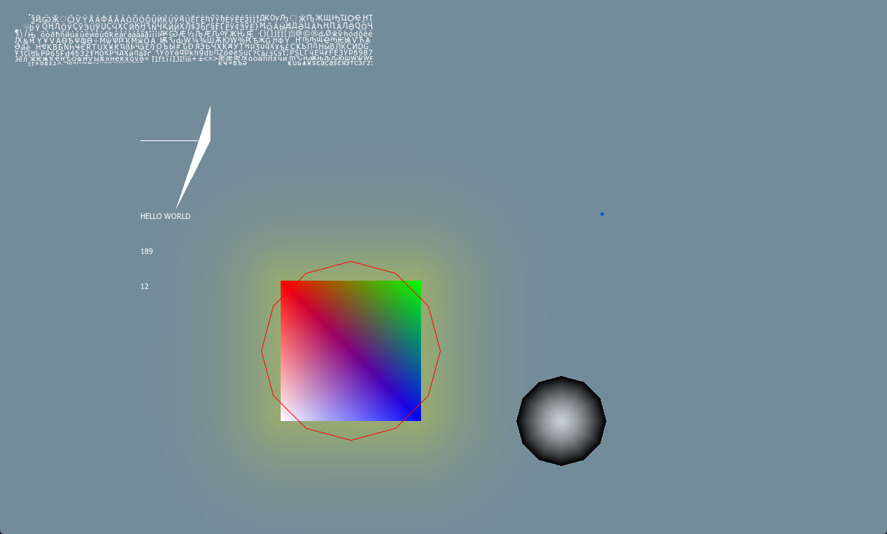

## Renderer

 - Basically this is just ImGui but without the GUI stuffs
 - Only freetype font support(x64 and x86 compatibility)
 - Has a basic priority draw list API (look into sandbox folder for example)
 ```c++
	size_t nId = pDrawCtx->AddDrawList( 0 );
	auto draw = pDrawCtx->GetDrawList( nId );
```
- Uhm I forgor as I did this like 3 years ago
## Credits
[ImGui](https://github.com/ocornut/imgui)
idk and everyone in the dependencies's folder

## Images
If you can actually build this congrats
